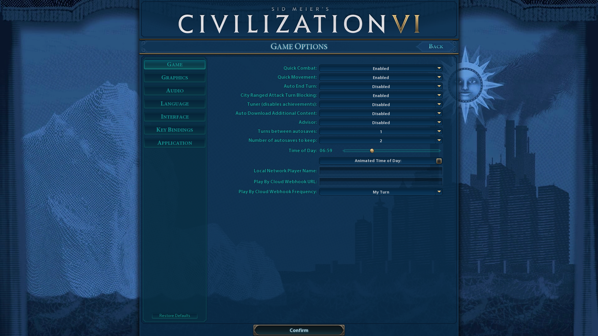
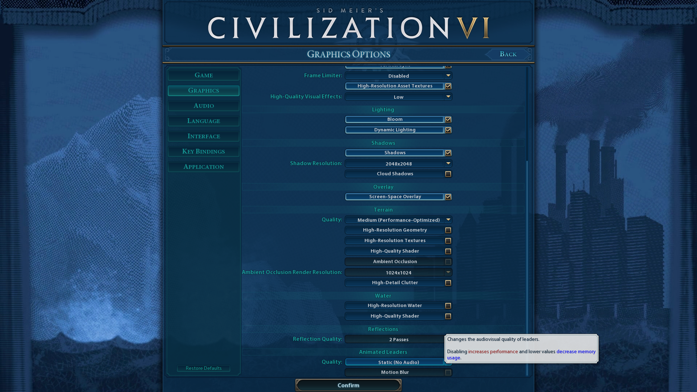
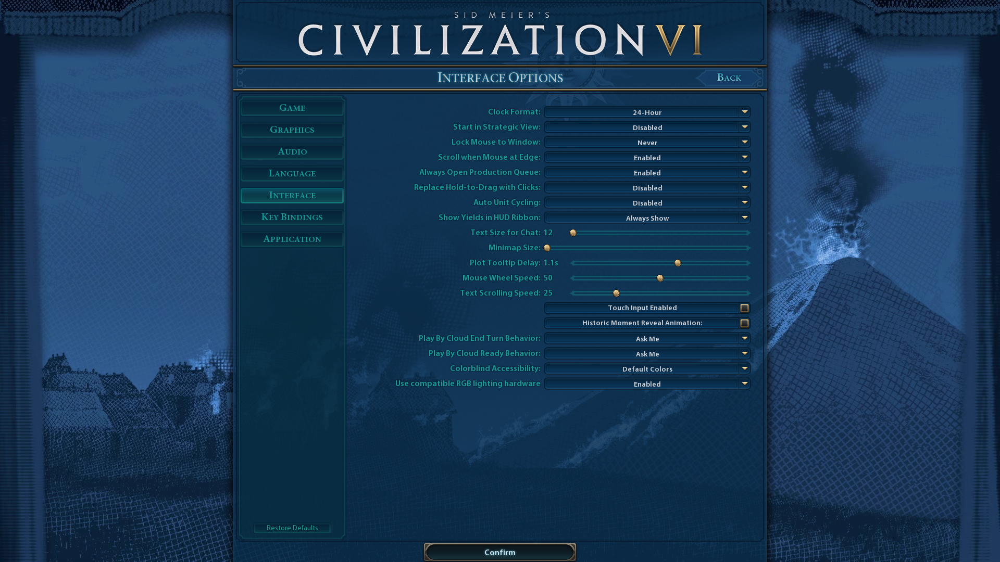
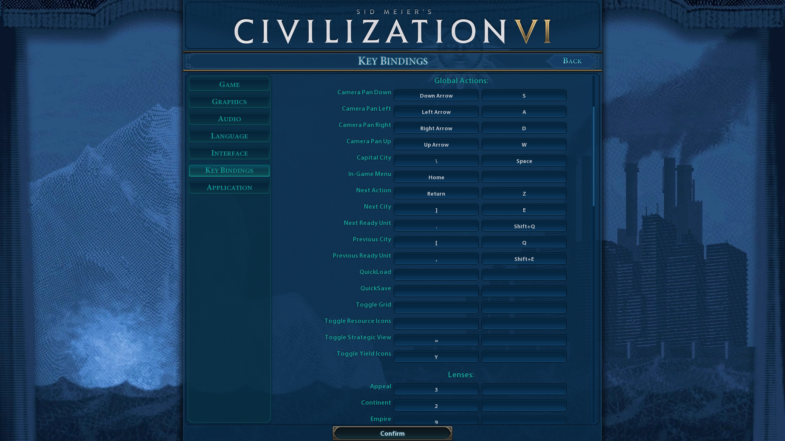
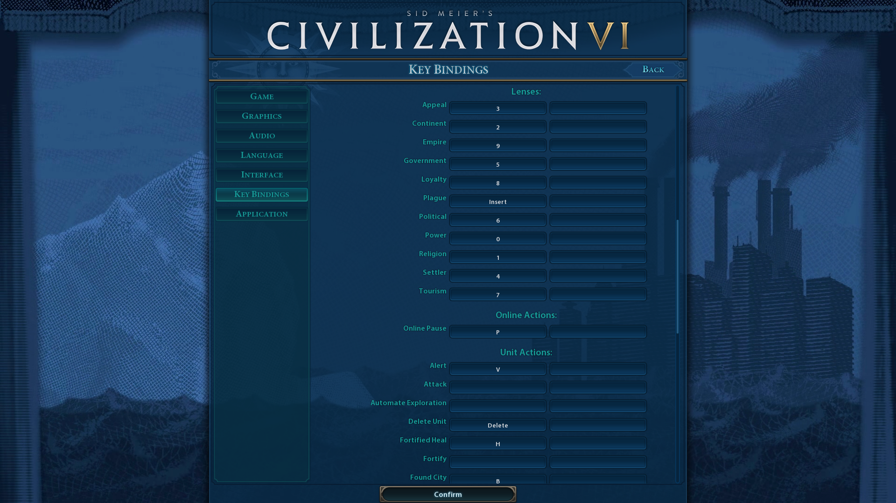
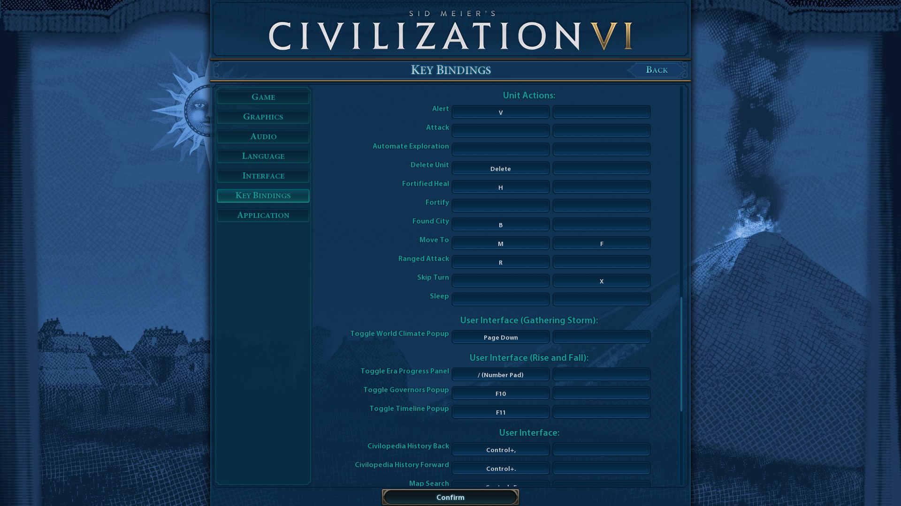
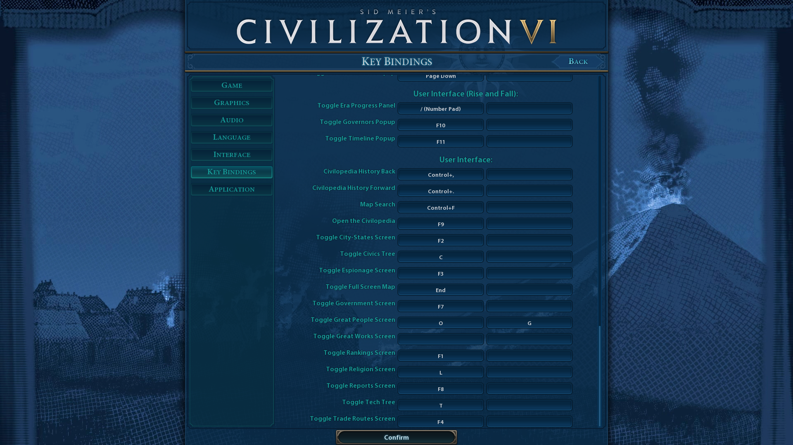

# Civilization VI

*- turn-based strategy game by Firaxis Games.*

## Installation

1. Install [Civilization VI](https://store.steampowered.com/app/289070/Sid_Meiers_Civilization_VI/).

## Configuration

1. Launch options:
    - DX12
1. Compatibility:
    - Force the use of a specific Steam Play compatibility tool (Proton Experimental).
1. Workshop:
    - [Better Builder Charges Tracking](https://steamcommunity.com/sharedfiles/filedetails/?id=2409116842)
    - [Better City States (UI)](https://steamcommunity.com/sharedfiles/filedetails/?id=2495851756)
    - [Better Espionage Screen](https://steamcommunity.com/sharedfiles/filedetails/?id=872296228)
    - [Better Levied Turns Tracking](https://steamcommunity.com/sharedfiles/filedetails/?id=2673627498)
    - [Better Report Screen (UI)](https://steamcommunity.com/sharedfiles/filedetails/?id=1312585482)
    - [Better World Rankings (UI)](https://steamcommunity.com/sharedfiles/filedetails/?id=2139486665)
    - [Detailed Map Tacks](https://steamcommunity.com/sharedfiles/filedetails/?id=2428969051)
    - [Extended Policy Cards](https://steamcommunity.com/sharedfiles/filedetails/?id=2266952591)
    - [Great Works Viewer](https://steamcommunity.com/sharedfiles/filedetails/?id=1652106496)
    - [NotificationClear](https://steamcommunity.com/sharedfiles/filedetails/?id=3063966792)
    - [Top Panel Extension Pro](https://steamcommunity.com/sharedfiles/filedetails/?id=2997927787)
    - [Unique District Icons](https://steamcommunity.com/sharedfiles/filedetails/?id=882664162)
1. Settings:
    
    
    
    
    
    
    
