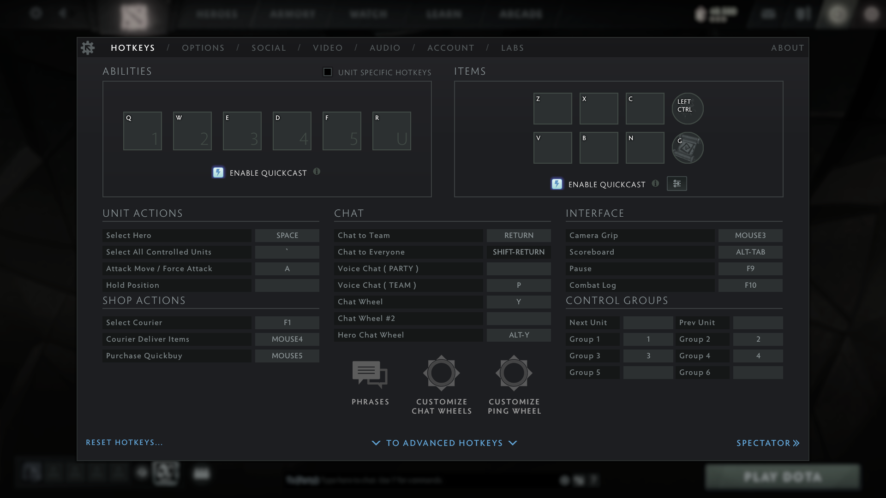
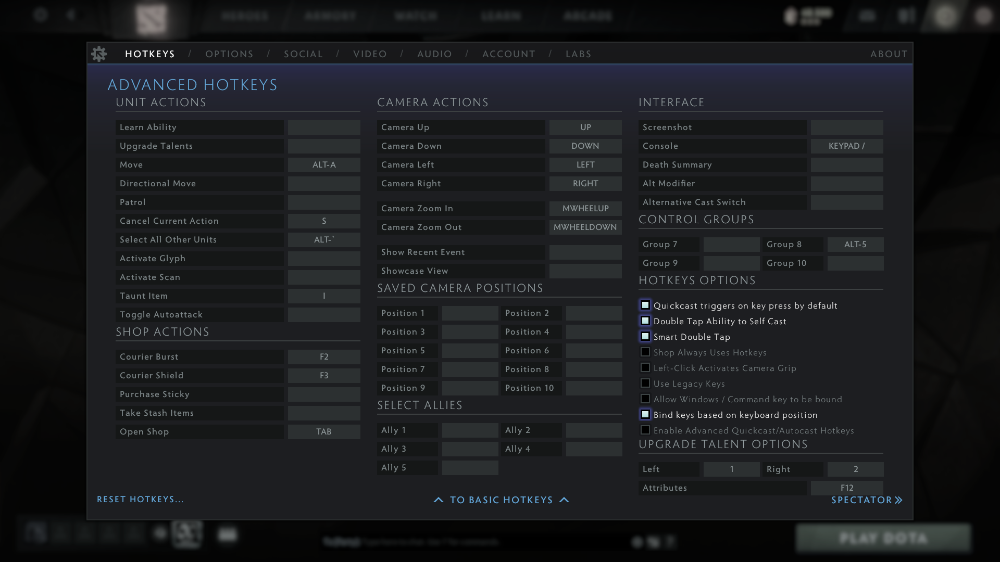
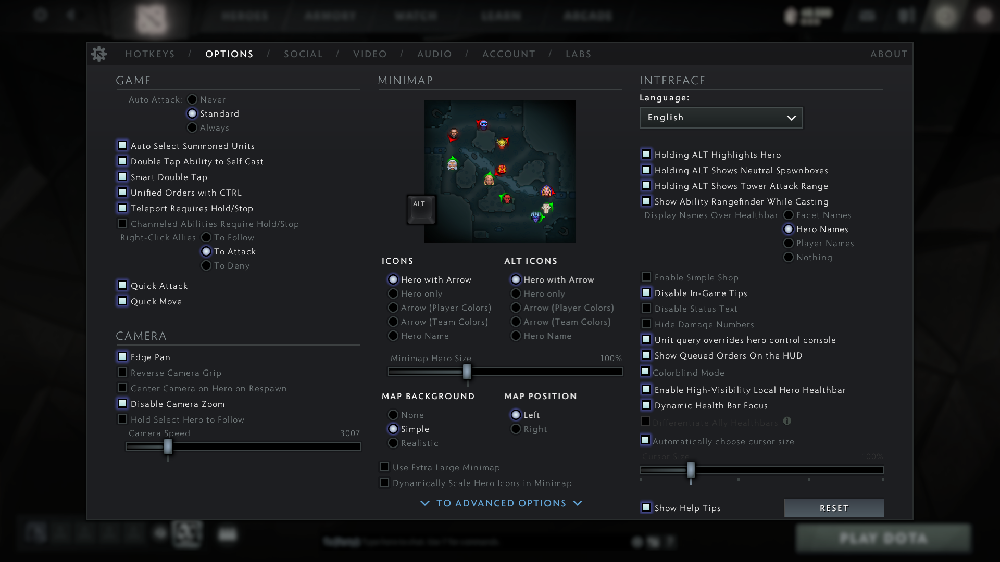
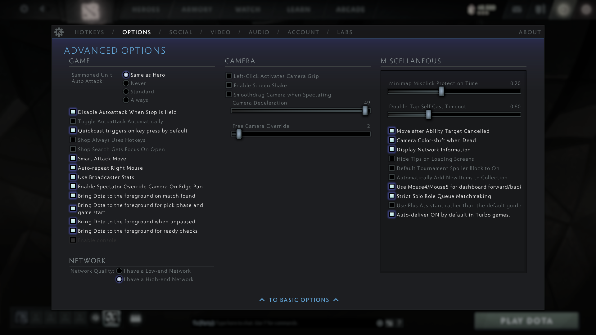
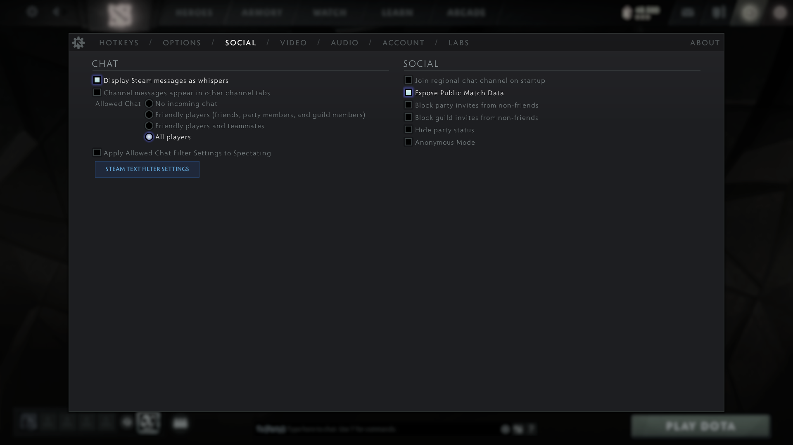
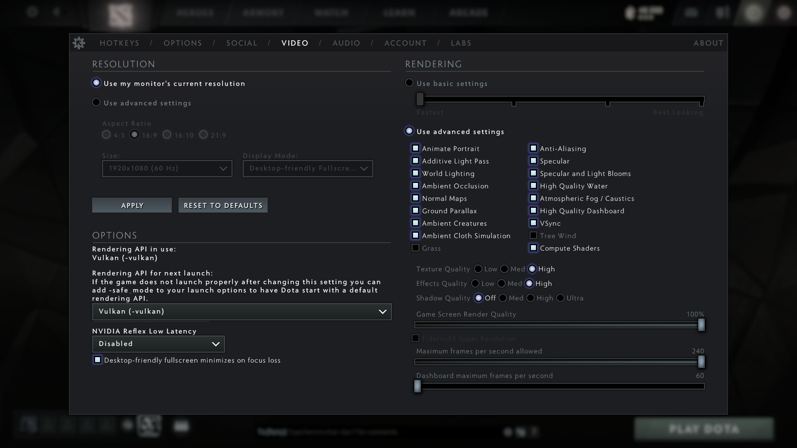
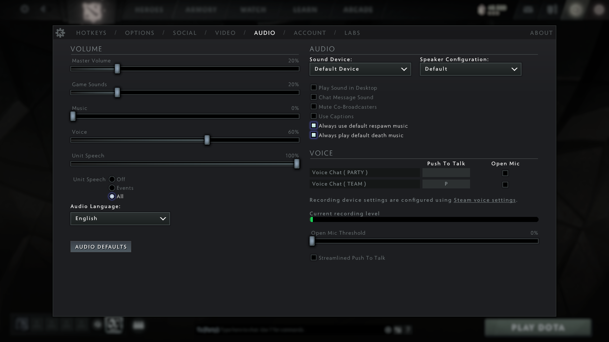
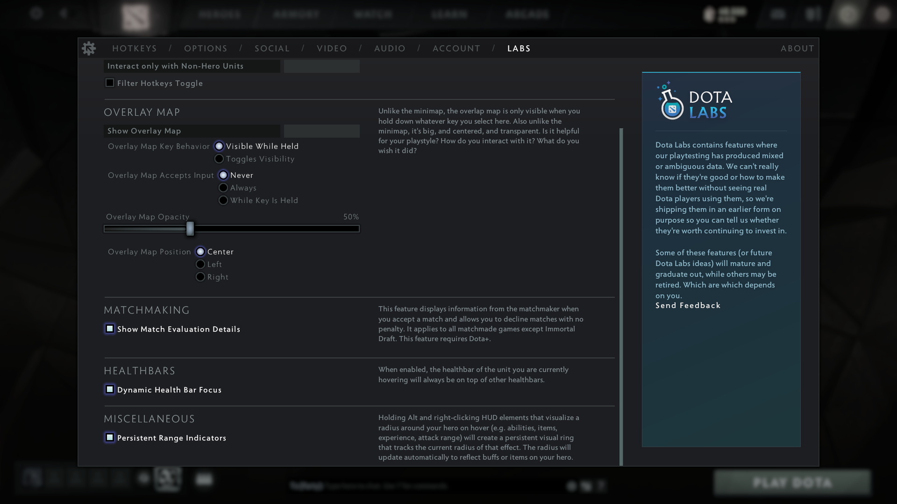
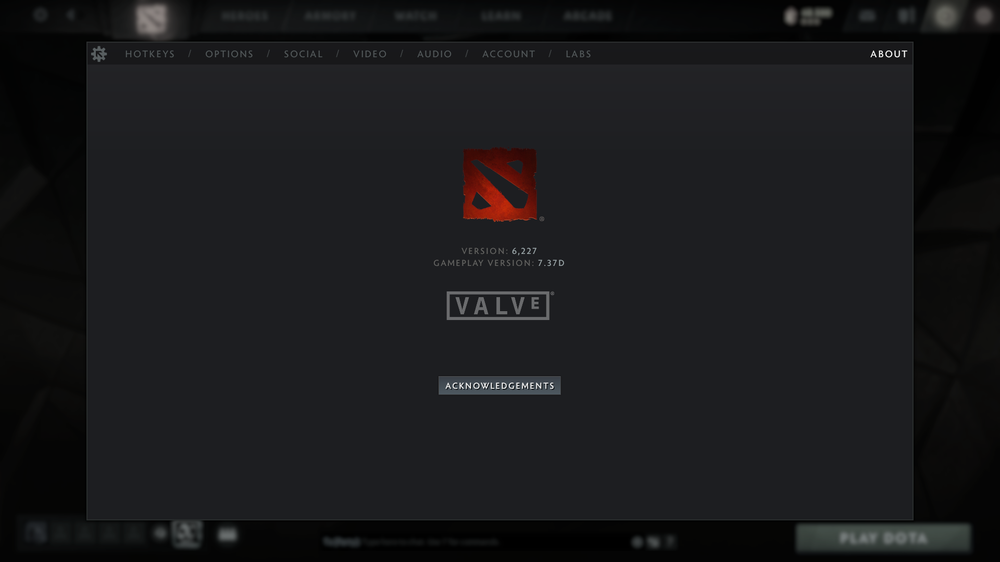

# Dota 2

*- 5v5 multiplayer online battle arena (MOBA) game by Valve.*

## Installation

1. Install [Dota 2](https://store.steampowered.com/app/570/Dota_2/).

## Configuration

1. [Launch options](https://liquipedia.net/dota2game/Launch_Options):
    ```
    -console +fps_max 240
    ```
1. [Settings](https://liquipedia.net/dota2/Settings):
    
    
    
    
    
    
    
    
    
